#### 1. [idea] Show initial message centered.
1. When plugin opened initially help message in all pane should be at center.
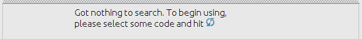  
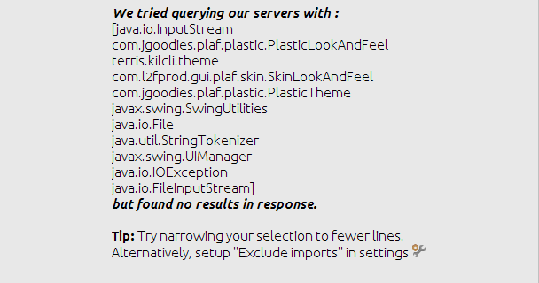  
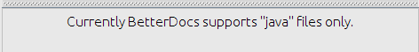  

#### 2. [idea] Introduced async fetching of results from elastic search server.
##### fixes <a href='https://github.com/Imaginea/KodeBeagle/issues/131'> #131 </a>
##### fixes <a href='https://github.com/Imaginea/KodeBeagle/issues/127'> #127 </a>
1. While fetching results IDE should not hang.

#### 3. [ideaplugin] show help info should autmatically bring the focus to main pane.
##### Display the content centered.
1. When help message is displayed all pane should get focus and help content should be in center.

#### 4. [ideaplugin] #141 Plugin throwing AIOBE has been fixed.
##### fixes <a href='https://github.com/Imaginea/KodeBeagle/issues/141'> #141 </a>
1. Add this line 'import ' in your code and hit refresh buttion.
2. NullPointerException will not be thrown.

#### 5. [ideaplugin] fixed the white background if highlighted code in new tab in main editor  is selected
##### fixes <a href='https://github.com/Imaginea/KodeBeagle/issues/117'> #117 </a>
1. When results in all pane/featured pane opened as new tab in IDE, selecting highlighted code 
	should be visible.
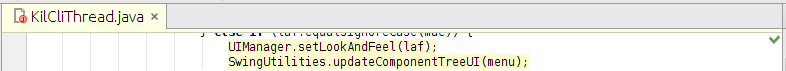  
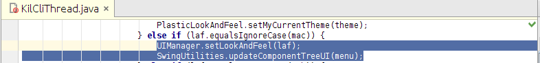  

#### 6. [ideaplugin] added git icon to tree nodes and goto github right click menu item
##### fixes <a href='https://github.com/Imaginea/KodeBeagle/issues/129'> #129 </a>
1. All Pane project tree non leaf nodes should have git icon.
2. All Pane project tree nodes right click "Go to Github" should have git icon.
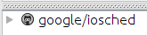  
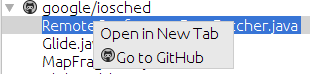  

#### 7. [ideaplugin]fixed editor window scroll
##### fixes <a href='https://github.com/Imaginea/KodeBeagle/issues/124'> #124 </a>
1. All Pane preview editor should be scrollable. 
2. 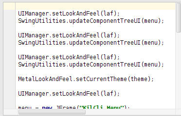

#### 8. [ideaplugin] removed foldings from main pane editor
##### modified wrong esURL message
##### disposed tiny editors in code pane after usage
##### fixes <a href='https://github.com/Imaginea/KodeBeagle/issues/112'> #112 </a>
1. All Pane preview editor should not have code foldings
2. No 'Editor has not been released..' Exception after closing the plugin. 
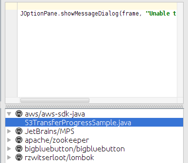 

#### 9. [ideaplugin] Right click and open files in a tab. + Expand to full source in a tab.
##### fixes <a href='https://github.com/Imaginea/KodeBeagle/issues/56'> #56 </a>
##### made files in editor readonly
##### added for jtree selection update preview pane, rightclick open in new tab
1. Right clicking project tree leaf nodes should have menu item as "Open in new tab" and clicking that should open file in new tab in IDE.
2. Opened file should be non editable.
3. Selecting leaf node in project tree should load it's preview in all pane preview editor. 
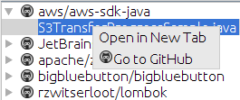  
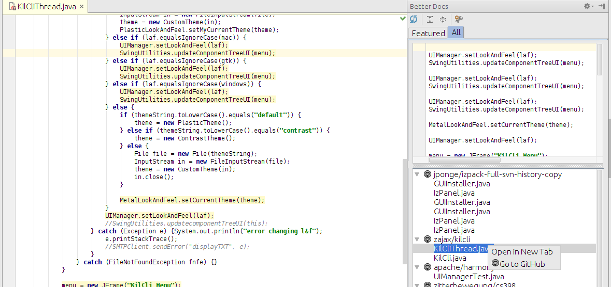  
  

#### 10. [ideaplugin] Ignored case while searching for import names in the selected text region.
##### fixes <a href='https://github.com/Imaginea/KodeBeagle/issues/114'> #114 </a>
1. Covered in ExtractImportsInLinesSuite test. 
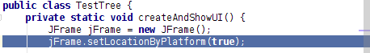
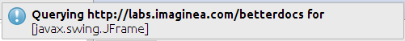

#### 11. [ideaplugin] Registered window editor with disposer to release after it's usage.
##### fixes <a href='https://github.com/Imaginea/KodeBeagle/issues/67'> #67 </a>
1. No 'Editor has not been released..' Exception after closing the plugin in idea.log/console. 
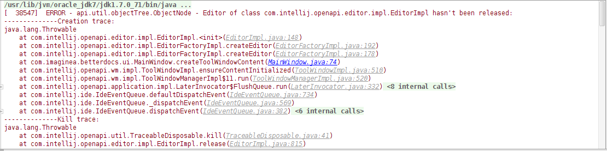 

#### 12. [ideaplugin] Taking number of tiny editors in featured pane through settings panel.
##### fixes <a href='https://github.com/Imaginea/KodeBeagle/issues/174'> #174 </a>
1. Click on settings in toolbar. This should open Settings panel. 
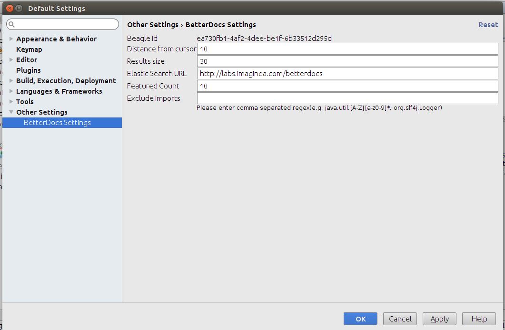
2. Change Featured Count to 10 and click on 'Apply' button followed by 'Ok' button
3. Hit refresh button.
4. In Featured Pane atmost 10 tiny editors should get populated.

#### 13. [ideaplugin] Tabbed UI alterations.
##### fixes <a href='https://github.com/Imaginea/KodeBeagle/issues/150'> #150 </a>
1. Open the KodeBeagle plugin, it should have two panes named Featured and all from left to right. 

2. Hit refresh button to check search results in both panes.

#### 14. [ideaplugin] Plugin throwing exception if HTTP response code from elastic search is not 200.
##### fixes <a href='https://github.com/Imaginea/KodeBeagle/issues/139'> #139 </a>
1. Open Settings Panel, change 'Elastic Search URL' to labs.imaginea.com. 
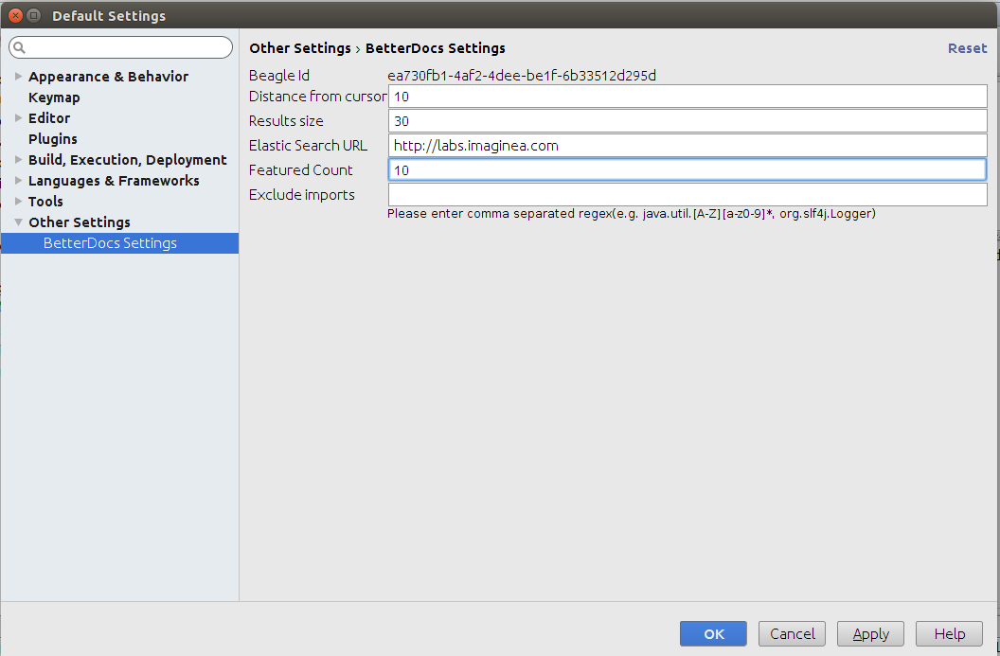
2. Apply and click 'Ok'.
3. Hit refresh button.
4. All Pane Should have message "Connection Error: 404 Not Found". 
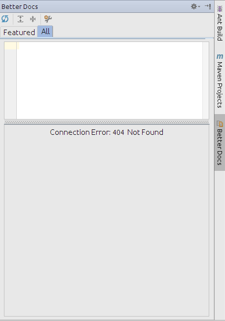
5. No Exception after closing the plugin in idea.log/console.

#### 15. [ideaplugin] Rename "Repo Stars" in Code Pane to "Score:" and make "Repo Name" clickable.
##### fixes <a href='https://github.com/Imaginea/KodeBeagle/issues/151'> #151 </a>
1. Open KodeBeagle plugin, select code and hit refresh action.
2. Check the featured pane tiny editors header, clicking on the project name should open project repo in github.com. 
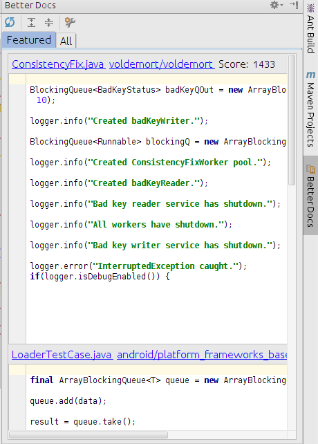

#### 16. [ideaplugin] Expire notification bubble in 3 or 4 seconds.
##### fixes <a href='https://github.com/Imaginea/KodeBeagle/issues/157'> #157 </a>
1. Open KodeBeagle plugin, select code and hit refresh action.
2. If ES Result returns no results notification should expire. 
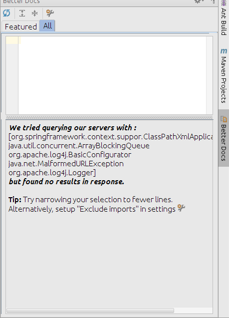

#### 17. [ideaplugin] NPE while using the plugin.
##### fixes <a href='https://github.com/Imaginea/KodeBeagle/issues/135'> #135 </a>
1. Open KodeBeagle plugin, select code from any non java file and hit refresh action.
2. No NullPointerException after closing the plugin in idea.log/console.

#### 18. [ideaplugin] Add UUID to request context and settins panel.
##### fixes <a href='https://github.com/Imaginea/KodeBeagle/issues/168'> #168 </a>
1. Open KodeBeagle plugin, click on settings and check the generated plugin ID. 
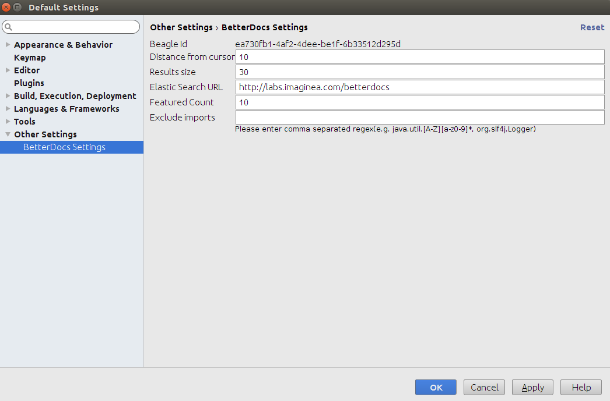
2. Plugin ID added to request context as well.

#### 19. [ideaplugin] Add plugin and idea version to user-agent.
##### fixes <a href='https://github.com/Imaginea/KodeBeagle/issues/194'> #194 </a>
1. Intellij idea version and plugin version added to user-agent.

#### 20. [ideaplugin] TinyEditors are not honoring soft wrap of intellij.
##### fixes <a href='https://github.com/Imaginea/KodeBeagle/issues/126'> #126 </a>
1. Open KodeBeagle plugin, select code and hit refresh action.
2. Make sure soft wrap is checked in intellij editor settings. 
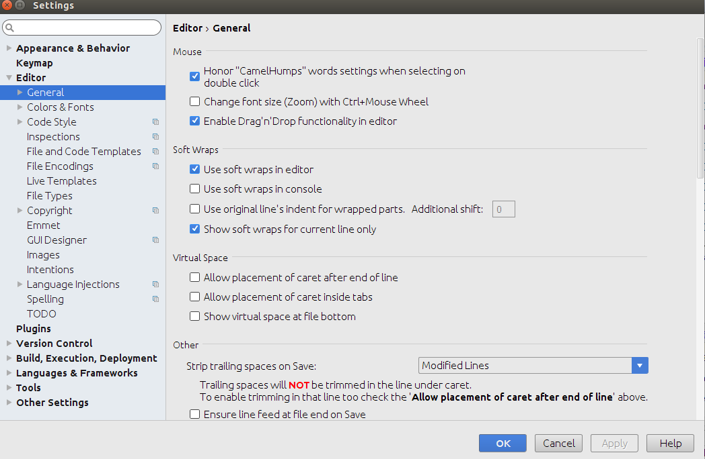
3. Check the featured pane tiny editors, try to resizing them.Tiny editors should honor intellij soft wrap. 
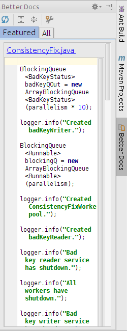

#### 21. [idea] #191 Added icon to plugin tool window in plugin.xml instead of setting it in MainWindow
##### fixes <a href='https://github.com/Imaginea/KodeBeagle/issues/191'> #191 </a>
1. KodeBeagle idea plugin should have icon even before you invoke it. 
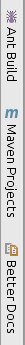

#### 22. [idea] #153 Added license agreement for using kodebeagle for first time
##### fixes <a href='https://github.com/Imaginea/KodeBeagle/issues/153'> #153 </a>
1. Using KodeBeagle for the first time should produce a Legal Notice dialog.
2. It should have two options "Accept" and "Decline"
3. On clicking "Accept" that dialog should disappear and allows you to use KodeBeagle.
4. On clicking "Decline" IDE should restart and kodebeagle is disabled. 
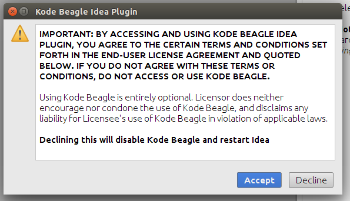

#### 23. [idea] #180 clearing all pane preview editor before every new request
##### fixes <a href='https://github.com/Imaginea/KodeBeagle/issues/180'> #180 </a>
1. After every new request(clicking refresh action button) contents of main window preview editor should be cleared. 
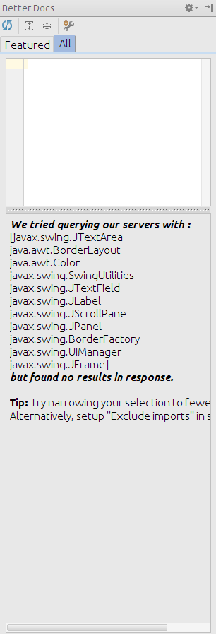

#### 24. [idea] #83 added keyboard shortcut to plugin
##### fixes <a href='https://github.com/Imaginea/KodeBeagle/issues/83'> #83 </a>
1. KodeBeagle idea plugin can be shown/hidden by hitting "alt" + 8

#### 25. [idea] #50 results will be updated on opening plugin window 
##### fixes <a href='https://github.com/Imaginea/KodeBeagle/issues/50'> #50 </a>
1. Every time plugin is opened(if previously it's hidden) results get automatically refreshed.

#### 26. [idea] #184 Fixed functionality of reset button in Settings Panel,
#### 'Reset' and 'Apply' buttons appear when values are changed.
##### fixes <a href='https://github.com/Imaginea/KodeBeagle/issues/184'> #184 </a>
1. Open settings panel from main window and type some values and click 'Ok' or 'Apply'. 
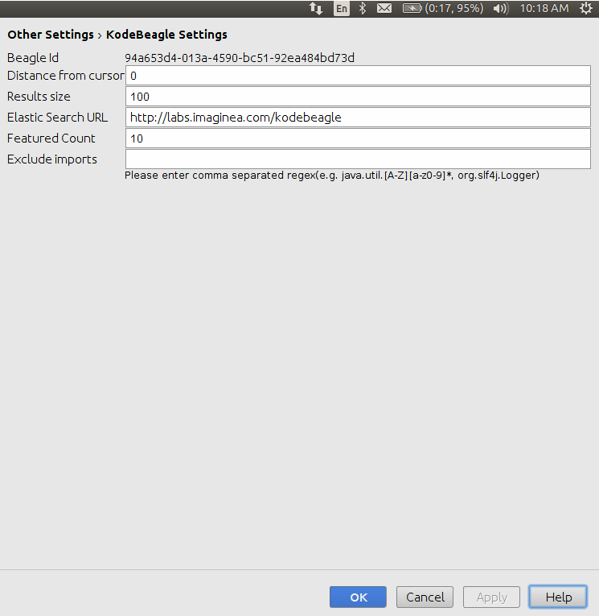
2. Reopen the panel and all the values that were persisted or previously applied should be displayed. 
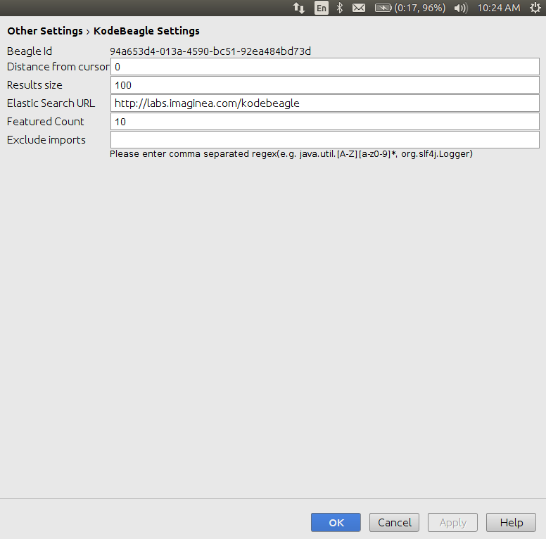
3. Also when there is a change in any of the values from previous values, the 'Apply' and 'Reset' 
button should appear. 
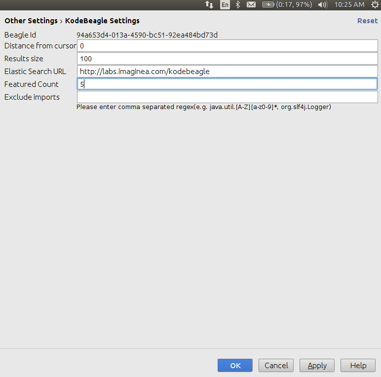
4. Open settings panel and make some changes in the values without clicking on 'Apply'. 
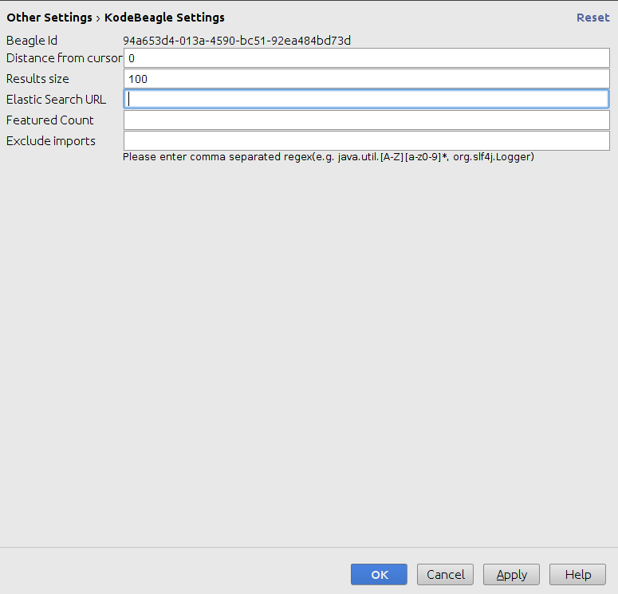
5. Click on 'Reset' Button which should reset all the values to previously set values. 
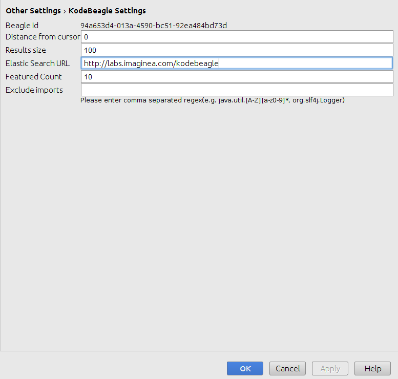

#### 27. [idea] #200 Show correct help message when no imports are present in java file
##### fixes <a href='https://github.com/Imaginea/KodeBeagle/issues/200> #200 </a>
1. Open KodeBeagle plugin, select code from any java file (with no imports present) and hit refresh action.
2. All pane should have message "Got nothing to search". 

#### 28. [idea] #203 Validation of User Input in Settings Panel 
##### fixes <a href='https://github.com/Imaginea/KodeBeagle/issues/203'> #203 </a>
1. Open Settings Panel from Main Window.
2. Type illegal values such as empty values, values with special characters in the distance, result size, featured
count. It should indicate respective warning messages. 
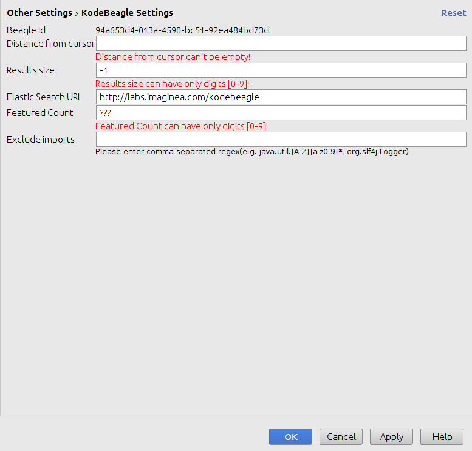
3. Type a deformed URL in the Elastic Search URL box. It should indicate saying that its not a well formed 
URL. 
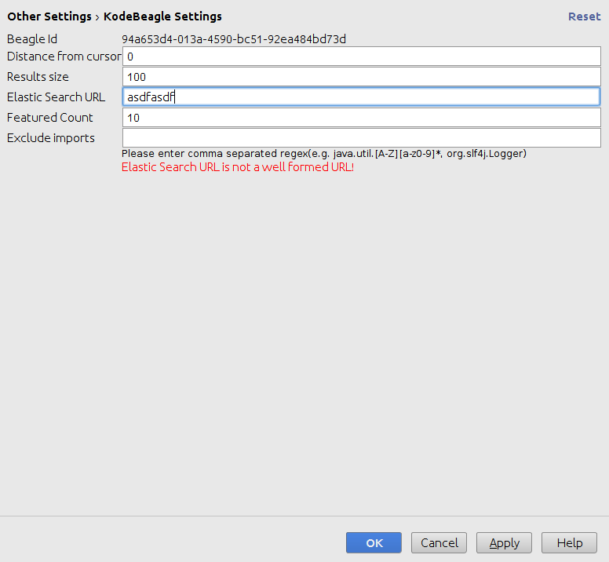 
4.Enter values more than 200, 500, 15 for distance, result size and featured count respectively. It should
indicate saying that values more than these limits are not allowed. 
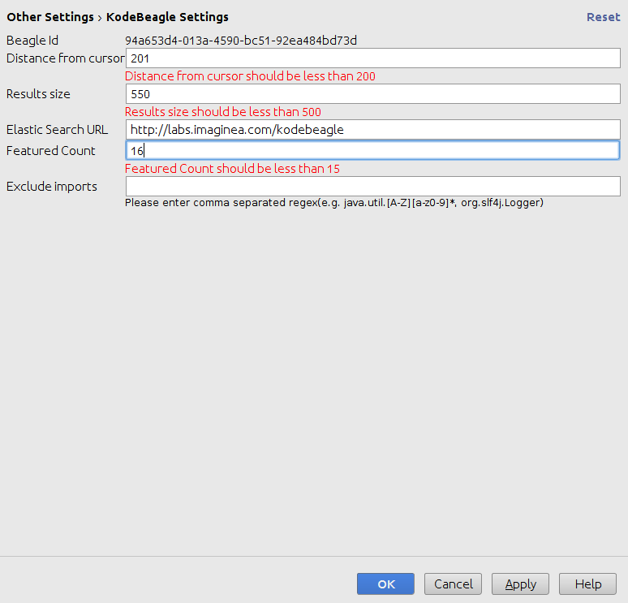 
5.Try entering more than 9 digits in distance, result size and featured count and it will not allow you to. 
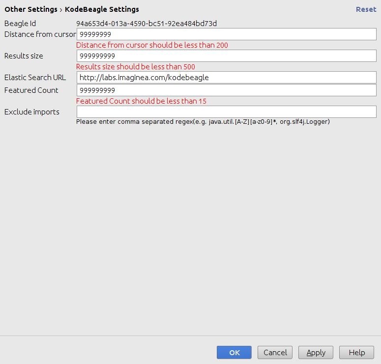 
6.Try clicking on 'Apply' button when there are validation errors. The apply button will not fade indicating that
these values can't be applied. 

#### 29. [idea] #211 Bad request due to long URL when fecthing many featured results (eg.featured count = 100)
##### fixes <a href='https://github.com/Imaginea/KodeBeagle/issues/211'> #211 </a>
1. Open Settings Panel from Main Window.
2. Type in a value greater than 30 for featured count.
3. Results will be fetched without a Bad Request or Bad Gateway error.
4. Verify the count of fetched results is same as expected.

#### 30. [idea] #167 Notification balloon shows time taken and number of results fetched.
##### fixes <a href='https://github.com/Imaginea/KodeBeagle/issues/167'> #167 </a>
1. Open Settings Panel From Main Window.
2. Select some code and hit the 'Refresh' button in the main window.
3. The notification balloon will show the time taken and number of results fetched. 
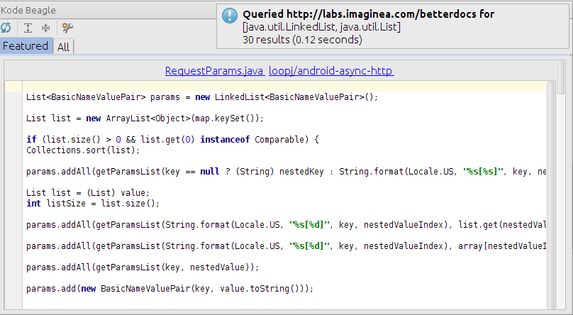 

#### 31. [idea] #104 Add line markers for #56
##### fixes <a href='https://github.com/Imaginea/KodeBeagle/issues/104'> #104 </a>
1. After opening the results file in new tab in editor you should see markers on the vertical markup bar of editor. 
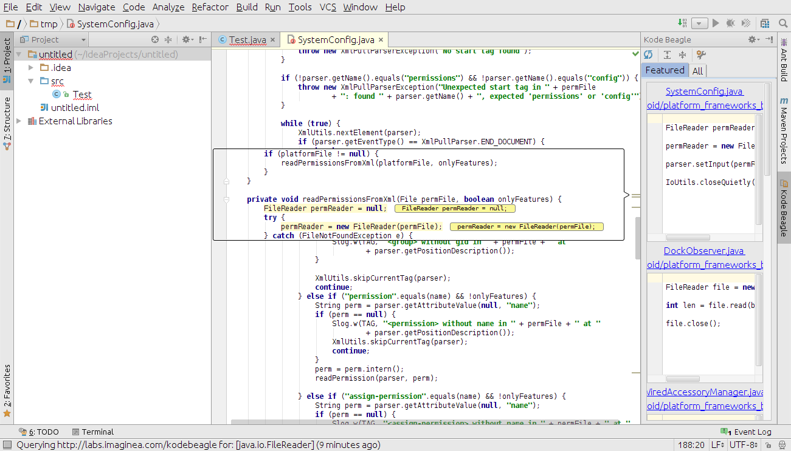 

#### 32. [idea] #255 Renaming labels in idea plugin
##### fixes <a href='https://github.com/Imaginea/KodeBeagle/issues/255'> #255 </a>
1. In Settings panel "Distance from cursor" should be renamed to "Lines from Cursor".
2. Featured tab in Main Window should be renamed to "Top"
3. In Main Window project tree should be followed by preview editor.
4. In Project Tree instead of "Go to Github" "Open in Browser" should be present when right clicked on any of the node. 
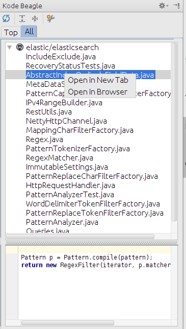 
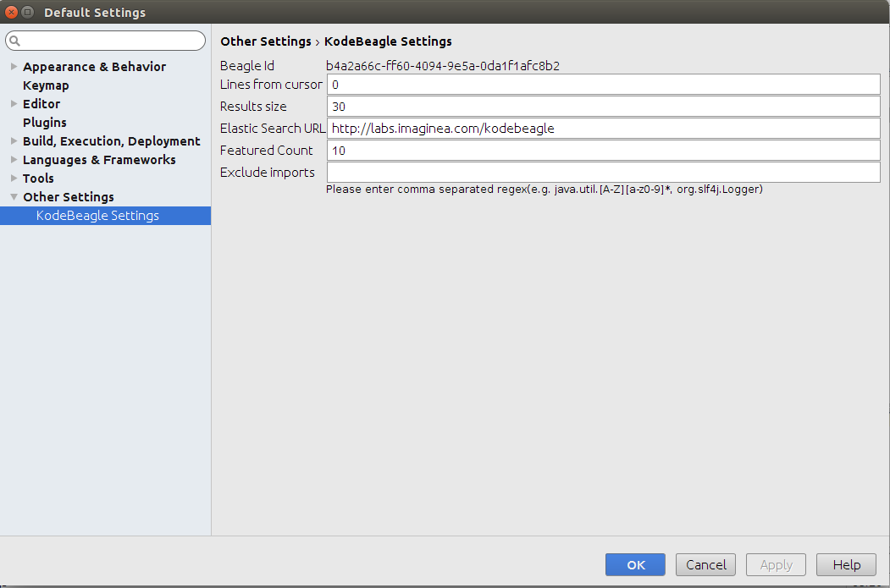 

#### 33. [idea] #250 Name display needs to be consistent
##### fixes <a href='https://github.com/Imaginea/KodeBeagle/issues/250'> #250 </a>
1. KodeBeagle name should be consistent across the plugin.

#### 34. [idea] #267 Make labels in header panel of tiny code editors in Top pane bold on mouse over.
##### fixes <a href='https://github.com/Imaginea/KodeBeagle/issues/267'> #267 </a>
1. Labels which displays filename and project name in header panels of tiny code editors should be
   bold when mouse over and should be normal on mouse exit.  
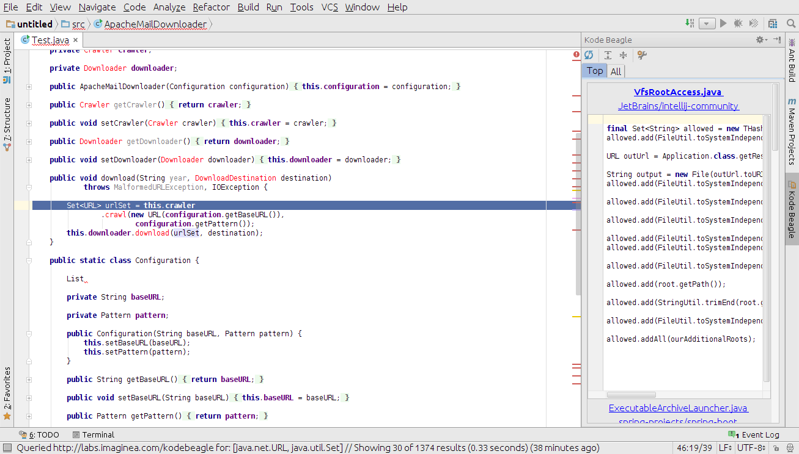 

#### 35. [idea] #269 Add Search with KodeBeagle before Search with google in editor right click menu
##### fixes <a href='https://github.com/Imaginea/KodeBeagle/issues/267'> #269 </a>
1. Select code in editor and right clicking an option "<icon>Search with KodeBeagle" should be listed and hitting that
   should open plugin window and perform search 
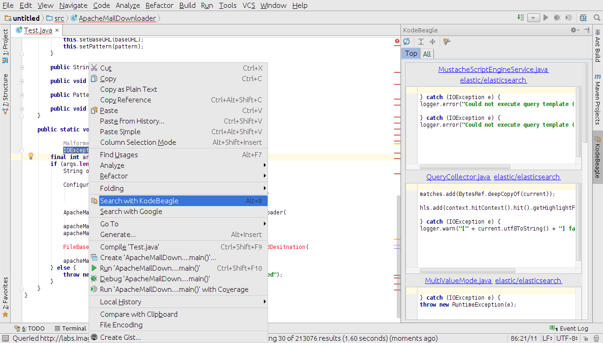 

#### 36. [idea] #271 Show information message "KodeBeagle supports only java files.." when trying to search from .class files.
##### fixes <a href='https://github.com/Imaginea/KodeBeagle/issues/271'> #271 </a>
1. Open KodeBeagle plugin, select some code from any .class file and hit refresh action. It will show information message
"Currently KodeBeagle supports "java" files only". 
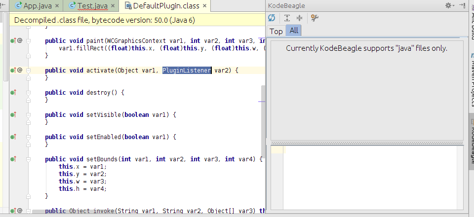 

#### 37. [idea] #242 Rework of Settings Panel
##### fixes <a href='https://github.com/Imaginea/KodeBeagle/issues/242'> #242 </a>
1. In settings panel, a user can select "Lines From Cursor" by sliding the cursor and a feedback to the user  
is shown in a textbox right next to it which is on focus when the slider moves. 
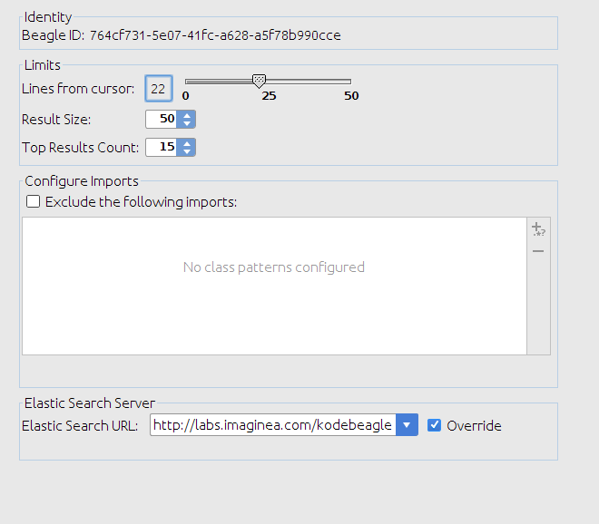 
2. In settings panel, spinners are used for selecting "Result Size" and "Top Count" which increase in steps of   
5 with their maximum values as 50 and 20 respectively.  
3. In settings panel, a user can add imports clicking on the add imports button under "Configure Imports Section"  
which displays a dialog box to enter the import pattern. 
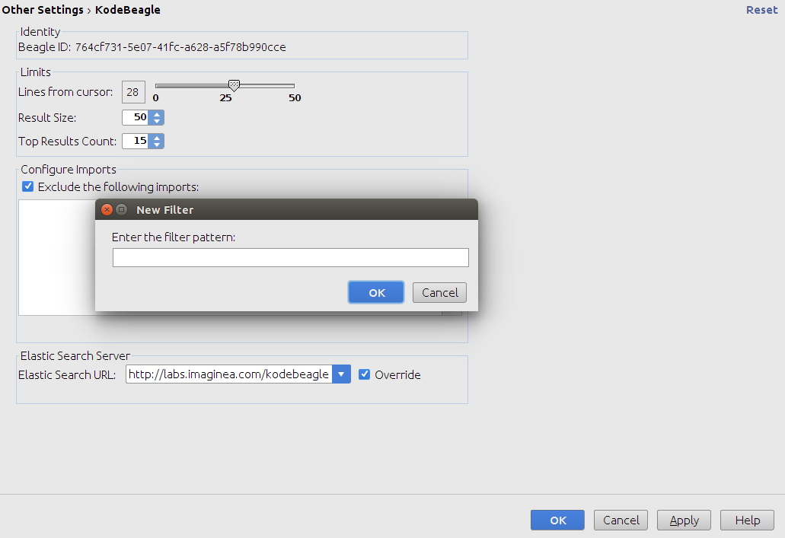 
4. In settings panel, a user can edit already added imports by simply double clicking on the import 
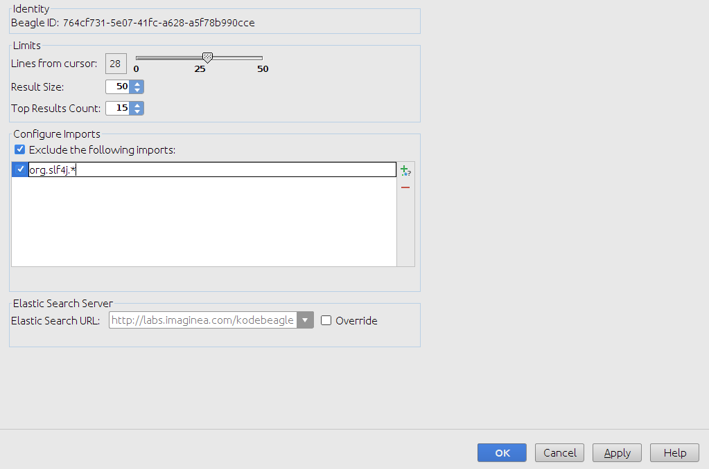 
5. In settings panel, a user can override the existing Elastic Search URL by checking the "Override" checkbox  
which focuses on the "Elastic Search URL" combo box and makes it enabled which allows input. 
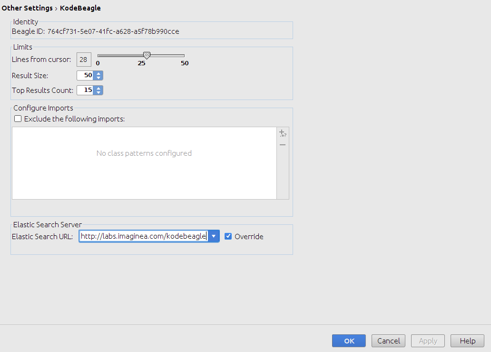 
6. In settings panel, when a user overrides the default Elastic Search URL any URL entered in the combo box is   
persisted. Thus a user can see the history of all his applied URLs. 
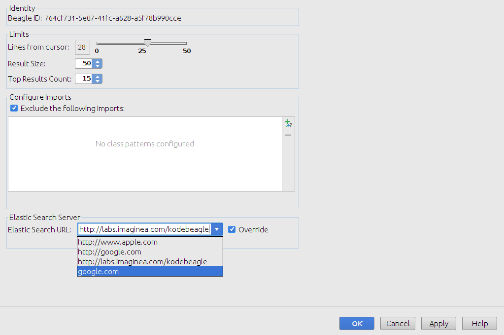 
7. In settings panel, the override checkbox for Elastic Search URL when unchecked restores the value to default value.

#### 38. [idea] #222 Expires previous notification before issuing new notification
##### fixes <a href='https://github.com/Imaginea/KodeBeagle/issues/222'> #222 </a>
1. On hitting "Refresh Action" too many times should not populate the IDE window with notifications.

#### 39. [idea] #299 New settings panel fixed for loading values persisted by old settings panel
##### fixes <a href='https://github.com/Imaginea/KodeBeagle/issues/299'> #299 </a>
1. New settings panel will load values persisted by old settings panel by comparing it with their limits. If the value
lies in the limit then it will be loaded or else default values will be loaded.

#### 40. [idea] #297 Opt-Out Mode added
##### fixes <a href='https://github.com/Imaginea/KodeBeagle/issues/297'> #297 </a>
1. In settings panel, a user can select the "Opt-Out" checkbox to enter into the Opt-Out Mode. In this mode the Beagle ID 
is not sent with each request and also in the settings panel its value is set to "Not Available" when settings are applied. 
Before Opt-Out mode 
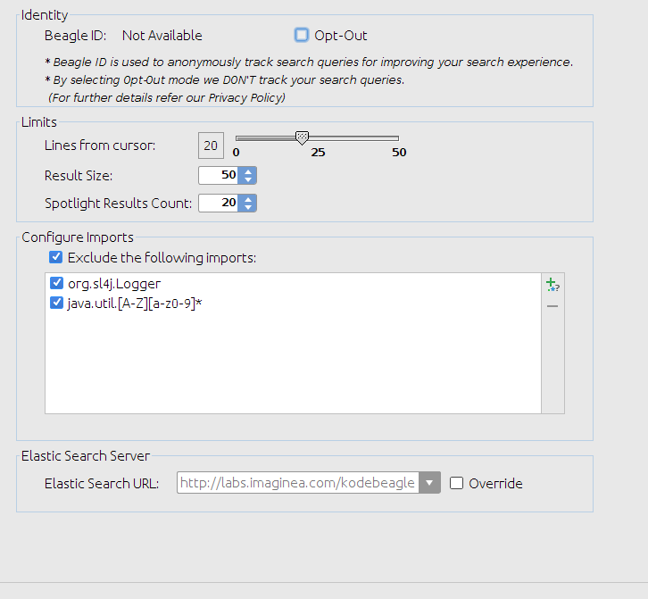 
After Opt-Out mode  
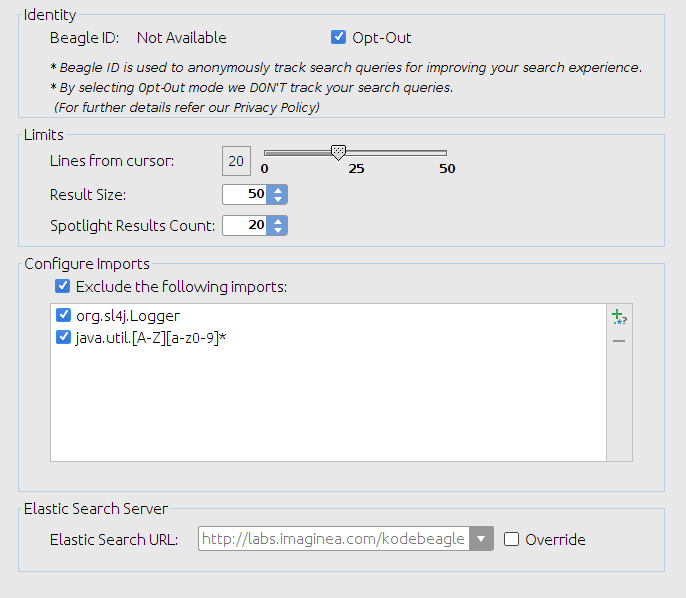
lies in the limit then it will be loaded or else default values will be loaded.

#### 41. [idea] #305 Fixed addition of empty import pattern while configuring imports 
##### fixes <a href='https://github.com/Imaginea/KodeBeagle/issues/305'> #305 </a>
1. While adding import patterns under the configure imports section, if the user tries to add an empty string then no import is added.

#### 42. [idea] #253 Fixed scrolling issue while scrolling results under the Spotlight tab
##### fixes <a href='https://github.com/Imaginea/KodeBeagle/issues/253'> #253 </a>
1. Now a user can scroll the outer panel while scrolling inside the tiny editors.

### 43. [idea] #302 Added CheckBox for enabling/disabling notifications and logging [ONLY UI]
#### fixes <a href='https://github.com/Imaginea/KodeBeagle/issues/302'> #302</a>
1. Added checkboxes for notifications and logging under the "Notifications" section. 
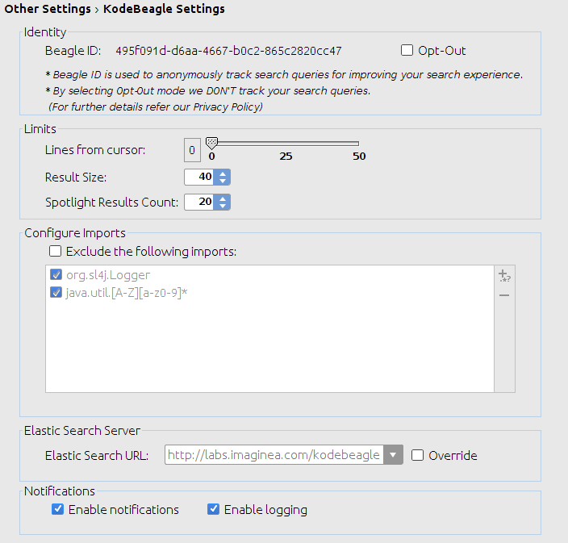
2. It should toggle the IDE System Event notification too.

#### 44. [idea] #326 Optimized scanning of internal imports
##### fixes <a href='https://github.com/Imaginea/KodeBeagle/issues/326'> #326 </a>
1. While using KodeBeagle in projects which contain many directories, the scanning of internal imports will not consume a lot of
time. 
Tried using KodeBeagle for Intellij project.